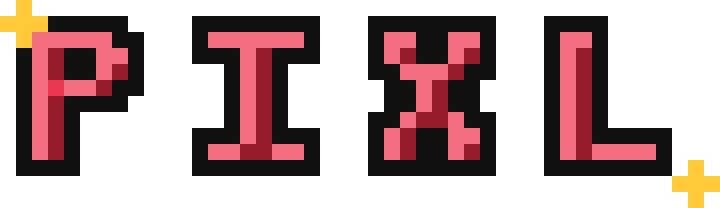
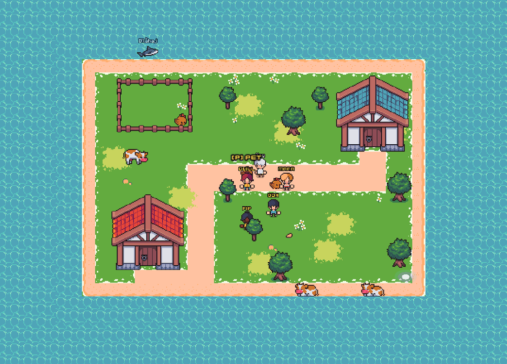
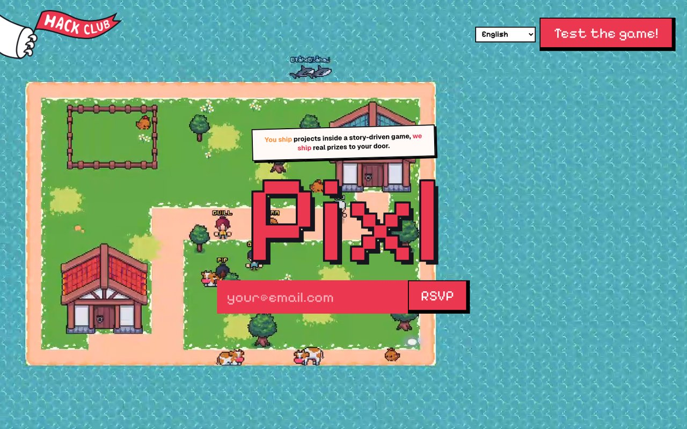
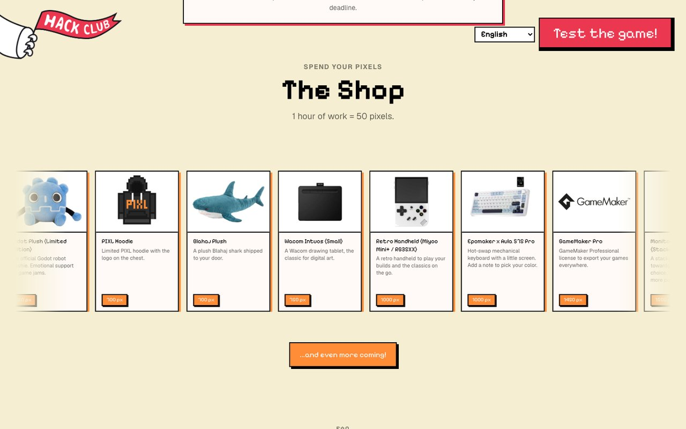
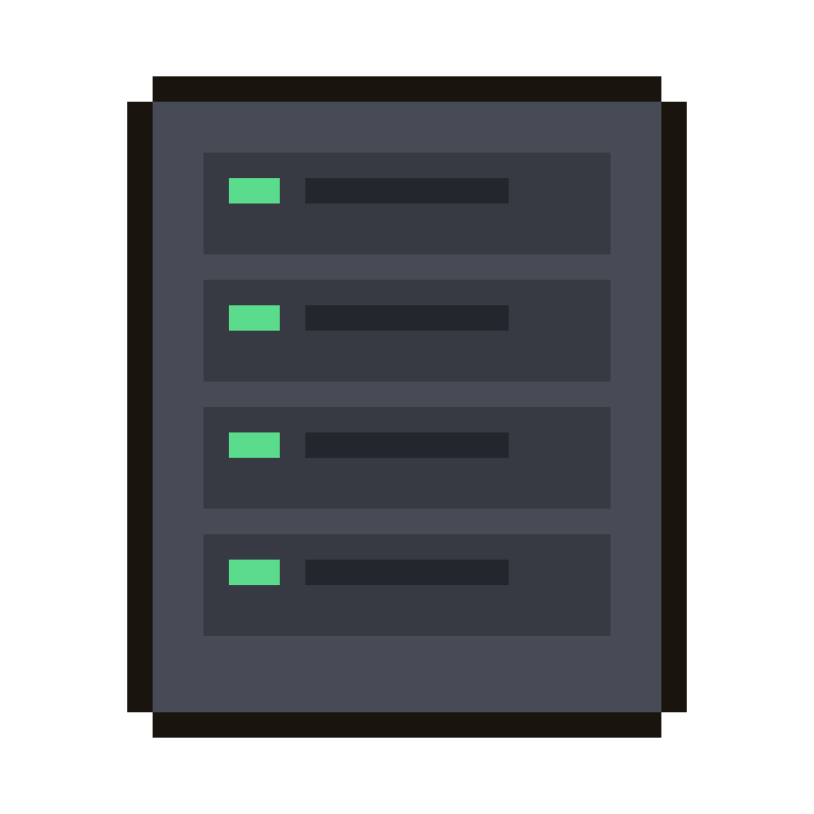

<h1 align="center">
  <br>
  
  <br>
</h1>

<h4 align="center">
A pixel-themed <a href="https://hackclub.com/">Hack Club</a> YSWS - ship real projects inside a story-driven 2D world, earn Pixels, unlock real prizes. Built by Gabin, Ridit, and Ricky.
</h4>

<div align="center">


</div>

<p align="center">
  <a href="#what-is-pixl">What is Pixl?</a> •
  <a href="#repository-structure">Structure</a> •
  <a href="#the-game">Game</a> •
  <a href="#the-landing-site">Landing</a> •
  <a href="#the-game-server">Server</a> •
  <a href="#the-admin-dashboard">Dashboard</a> •
  <a href="#pixorpheus">Pixorpheus</a> •
  <a href="#getting-started">Getting Started</a>
</p>

<br>

<p align="center">
Centuries ago, <b>Origin</b> was the greatest digital civilization ever built - until the <b>Great Static</b> shattered it into islands lost in the <b>Void</b>. Its people crossed universes and found Hack Clubbers, who are rebuilding it under a new name: <b>Pixl</b>.
</p>

---

## Table of Contents

- [What is Pixl?](#what-is-pixl)
  - [How it works](#how-it-works)
  - [Sidequests vs. shipping your own project](#sidequests-vs-shipping-your-own-project)
- [Repository Structure](#repository-structure)
- [The Game](#the-game)
- [The Landing Site](#the-landing-site)
- [The Game Server](#the-game-server)
  - [API Routes](#api-routes)
  - [Real-time layer](#real-time-layer)
  - [Economy](#economy)
  - [Database](#database)
- [The Admin Dashboard](#the-admin-dashboard)
- [Pixorpheus](#pixorpheus)
- [Getting Started](#getting-started)
  - [Prerequisites](#prerequisites)
  - [Install](#install)
  - [Environment Variables](#environment-variables)
  - [Run](#run)
  - [Database Migrations](#database-migrations)
- [Contributing](#contributing)
- [License](#license)

---

## What is Pixl?

Pixl is a **YSWS** ("You Ship, We Ship") - a program format from [Hack Club](https://hackclub.com/), the 501(c)(3) nonprofit with 60,000+ technical high schoolers. In a YSWS, teenagers ship a real project and get real hardware or prizes back, no strings attached. Pixl wraps that idea in a story: you're not just submitting a project to a form, you're repairing a broken digital world one shipped project at a time.

**Why the name?** Centuries ago, Origin was the greatest digital civilization ever built, until the Great Static shattered it into islands lost in the Void. Its people crossed universes and found Hack Clubbers, who are rebuilding it - under a new name: Pixl.

- 100% free, and every completed project gets funded - no lottery, no "maybe"
- Anyone can join: teen hackers, first-timers, designers, curious friends. No team required, solo is fine, mentors help if you're stuck
- Launches **August 18th, 2026** - there's a live countdown on [pixl.rsvp](https://pixl.rsvp)

### How it works

| Step | |
|---|---|
| **01** | **Join the World** - create your character (your own 16×16 pixel avatar) and drop into a shared, retro 2D open world |
| **02** | **Explore Regions** - cyberpunk cities, underwater zones, gambling districts, and more, each locked behind community progress |
| **03** | **Pick a Sidequest (or don't)** - NPCs in unlocked regions need apps, sites, and hardware built. Or ship something entirely your own - that counts too |
| **04** | **Ship & Earn** - submit your project through the in-game Pip NPC. Real reviewers grade it through the [admin dashboard](#the-admin-dashboard) |
| **05** | **Get Repaid** - every shipped project becomes **Restoration Energy**: hours of work that repair a piece of Pixl and convert into a real prize plus **Pixels**, the in-game currency |
| **06** | **Spend Pixels** - the [in-game shop](#the-game-server) turns Pixels into grants, hardware, and merch |

This is **"You Repair, the Core Pays"** - the Core is a vault of old Pixelian tech that gives back real prizes and grants matched to what you built. The story advances in **~3-week chapters** (the whole community's combined restoration work unlocks a new region, NPCs, and sidequests when a chapter goal is hit), with **~1-week Operations** in between - short themed events like a game jam or a hackathon. You always earn your own prize and Pixels regardless of what the rest of the community does, and joining late is never a disadvantage: unlocked regions never close, and you can pick any available sidequest at any time.

### Sidequests vs. shipping your own project

Sidequests are pre-defined problems an NPC in an already-unlocked region needs solved, roughly tiered by size:

| Tier | Approx. hours | Example |
|---|---|---|
| Beginner | ~7h | Build a merchant's storefront → domain + stickers · Make a Roblox game → 2,000 Robux |
| Intermediate | ~20–30h | Ship a mobile app → Apple Developer account · Design a game region → graphics tablet |
| Expert | ~55–65h | Network intrusion detection system → Flipper Zero · Build a robot arm → full PCB manufacturing run |

Prizes are swappable for equivalent value. You don't have to take a sidequest at all - shipping something entirely of your own still earns hours, Restoration Energy, and Pixels the same way.

---

## Repository Structure

Pixl is a [Bun](https://bun.com) + [Turborepo](https://turbo.build/) monorepo. Every app talks to the same [Supabase](https://supabase.com/) (Postgres) project directly rather than through a shared internal API, plus Hack Club Auth / Slack OAuth for identity.

```
pixl/
├── apps/
│   ├── server/          Bun game server - Express + WebSocket + Drizzle
│   ├── game/             Godot 4 game client
│   ├── landing/          Next.js marketing site (pixl.rsvp)
│   ├── dashboard/        Next.js admin/review dashboard
│   └── pixorpheus/       Slack bot - tickets, AI chat, moderation
├── packages/              Shared packages (types, ui, utils, config - scaffolded)
├── package.json           Monorepo root (Bun workspaces + Turborepo)
└── bun.lock
```

| App | Stack | Description |
|---|---|---|
| [`server`](apps/server) | Bun, Express, `ws`, Drizzle ORM, Supabase | Game server - auth, player state, real-time multiplayer, projects, shop, economy |
| [`game`](apps/game) | Godot 4 (GDScript) | The 2D multiplayer world players see and play in |
| [`landing`](apps/landing) | Next.js 16, React 19, Tailwind 4 | Marketing site at [pixl.rsvp](https://pixl.rsvp) - localized in English, French, Spanish, Portuguese |
| [`dashboard`](apps/dashboard) | Next.js 16, React 19, Tailwind 4, shadcn/radix | Admin dashboard - project review, moderation, tickets, shop, stats |
| [`pixorpheus`](apps/pixorpheus) | Node.js, Slack Bolt v4, Express | Slack bot - help tickets, AI chat, moderation DMs, slash commands ([full docs](https://github.com/gabouin/pixorpheus)) |

### Packages

Shared libraries used across apps (currently scaffolded, not yet populated):

| Package | Purpose |
|---|---|
| `types` | Shared TypeScript type definitions |
| `ui` | Shared React UI components |
| `utils` | Shared utility functions |
| `config` | Shared ESLint, Tailwind, TypeScript configs |

---

## The Game



`apps/game` is the actual 2D multiplayer world, built in **Godot 4** (GDScript, not TypeScript). It exports both as a native build and as a WebAssembly build embedded on the web (`apps/game/web/`), which is how players reach it from a browser at [play.pixl.rsvp](https://play.pixl.rsvp).

Key client-side systems (`apps/game/scripts/`):

| System | File(s) | What it does |
|---|---|---|
| Multiplayer world | `multiplayer_world.gd`, `network_manager.gd`, `remote_player.gd` | Keeps every connected player's position/state in sync over WebSocket |
| Character & skins | `character_editor.gd`, `skin_util.gd` | Draw-your-own 16×16 pixel avatar |
| Villages & lobbies | `village.gd`, `lobby_menu.gd`, `house_interior.gd`, `door_trigger.gd`, `house_trigger.gd`, `stair_trigger.gd` | Shared open world plus private "village" instances players can retreat to |
| NPCs & dialogue | `npc.gd`, `dialogue.gd`, `markdown_util.gd` | Sidequest-giving NPCs and their (Markdown-capable) dialogue |
| HUDs | `chat_hud.gd`, `friends_hud.gd`, `emote_hud.gd`, `minimap_hud.gd`, `inbox_hud.gd`, `profile_hud.gd`, `player_hud.gd`, `guide_hud.gd` | In-game chat, friends list, emotes, minimap, inbox/notifications, profile card, first-run guide |
| Web bridge | `web_pages.gd` | Opens browser-hosted pages (shop, vault, explore, quests, timeline, projects, report, docs, hackatime) from inside the game, passing the player's session token |
| Animals & world dressing | `animal.gd`, `water.gd`, `shadow.gd`, `music.gd` | Ambient world life, water shaders, dynamic shadows, music |

The web pages opened via `web_pages.gd` (shop, vault, explore, etc.) are hand-written static pages under `apps/game/web/`, sharing a small helper library (`pixl.js`) that exposes `Pixl.api`, `Pixl.send`, `Pixl.loadWallet`, and `Pixl.mountTopbar` - they call straight into [the game server's API](#the-game-server) using the token the Godot client hands them.

---

## The Landing Site



`apps/landing` is the public marketing site at [pixl.rsvp](https://pixl.rsvp) - built with **Next.js 16**, React 19, and Tailwind 4, and fully localized (`en`/`fr`/`es`/`pt`) via `app/[lang]/dictionaries/*.json`.

| Section | Component | Purpose |
|---|---|---|
| Hero | `Hero.tsx` | The pitch, RSVP email capture, "Test the game" CTA |
| Story | `Story.tsx` | The Origin / Great Static / Void lore, in short form |
| Sidequests | `Sidequests.tsx` | An auto-scrolling marquee of example sidequests |
| Shop | `Shop.tsx` | An auto-scrolling, drag-to-scroll marquee of real shop items with live Pixel prices |
| FAQ | `FAQ.tsx` | Common questions (who can join, is it really free, when does it launch...) |
| Example Submission | `ExampleSubmission.tsx` | Shows what a real project submission looks like |
| Language switcher | `LanguageSwitcher.tsx`, `LocaleProvider.tsx` | Client-side locale switching without a full reload |



The Shop carousel (screenshot above) mirrors the real in-game shop 1:1 - item name, description, image, and Pixel price all come from `Shop.tsx`'s `ITEM_IMAGES`/`ITEM_PRICES` arrays plus each locale's `shop.items` dictionary, kept in exact index alignment across all 4 languages. The marquee itself is a hand-rolled `requestAnimationFrame`-driven component (not Framer Motion's `animate()`) so that pressing down reliably pauses it mid-scroll and dragging still moves items smoothly.

`vercel.json` proxies a long list of routes (`/play`, `/shop`, `/vault`, `/explore`, `/quests`, `/timeline`, `/projects`, `/report`, `/docs`, `/hackatime`, plus the WASM game assets) straight through to `play.pixl.rsvp`, so the game and its web pages are reachable under the main `pixl.rsvp` domain.

---

## The Game Server



`apps/server` is the authoritative backend: a **Bun** process running **Express** for HTTP routes and raw **WebSocket** (`ws`) for real-time game state, with **Drizzle ORM** over a **Supabase** (Postgres) database.

<br clear="left">

### API Routes

All mounted from `src/index.ts`, one router per concern (`src/routes/*.ts`):

| Router | Handles |
|---|---|
| `auth` | Hack Club Auth (HCA) login flow, JWT session issuance/validation |
| `profile` | Player profile data, onboarding progress |
| `projects` | Project submission, ships archive |
| `hackatime` | Coding-time tracking integration (auto-computed project hours) |
| `shop` | `GET /api/shop/items`, `POST /api/shop/buy/:id`, `POST /api/shop/claim/:id` - the real purchasing flow |
| `sidequests` | Sidequest listing and completion |
| `story` | Chapter/Operations story state |
| `explore` | Region/world exploration data |
| `friends` | Friends list, requests |
| `notifications` | In-game inbox/notifications |
| `events` | Community/world events |
| `vault` | The Core's vault - community goal progress |
| `reports` | Player-submitted reports |
| `uploads` | Image/asset uploads (screenshots, avatars) |
| `admin` | Endpoints the [dashboard](#the-admin-dashboard) calls with a server-side admin key |

### Real-time layer

`src/ws/gameServer.ts` is the authoritative multiplayer loop (player positions, chat, presence), and `src/ws/lobbies.ts` handles grouping players into the shared open world vs. private villages.

### Economy

`src/xp.ts` defines the whole payout curve:

```
XP = 1 per approved project hour, level = XP capped at 100
Pixels/hour = 50 (base) ramping linearly to 79 (at level 100)
i.e. 1 hour of approved work ≈ 50–79 Pixels depending on your level
```

Every Pixel change is logged to `pixel_transactions` (reasons like `shop_purchase` / `shop_refund`) so the full economy is auditable. The shop itself (`shop_items`, `shop_orders`, `shop_claims` tables) supports both purchasable items (bought with Pixels via the `buy_shop_item` Postgres function) and XP-gated trophies (`unlock_xp > 0`, claimed rather than bought).

### Database

Schema lives in two places:
- `src/db/schema.ts` - Drizzle-managed tables (`db:generate` / `db:migrate`)
- `drizzle/*.sql` - sequential raw SQL migrations, including data-only ones (e.g. seeding shop items)

Cross-cutting concerns: `moderation.ts` / `imageModeration.ts` (content moderation feeding the dashboard's review queue), `rateLimit.ts`, `shipsArchive.ts` (project submission history).

---

## The Admin Dashboard


`apps/dashboard` is the internal tool the Pixl team uses to actually run the program - review submissions, manage the shop, and moderate. It's a Next.js 16 app (shadcn/radix UI) gated behind Hack Club Auth plus a Slack-ID allowlist (`ADMIN_SLACK_IDS`), with a second, stricter allowlist (`SECOND_PASS_SLACK_IDS`) for who can give final project approval and credit Pixels.

<br clear="left">

| Page | Purpose |
|---|---|
| `review` | The project review queue - first-pass and final-pass grading |
| `projects` | All submitted projects |
| `players` | Player list and profiles |
| `sidequests` | Manage available sidequests |
| `story` | Manage chapters/Operations story state |
| `community-goals` | Manage vault levels - the community-wide chapter-unlock thresholds |
| `shop` | Create/edit/toggle/delete real shop items (name, description, price, image, options) |
| `fulfillment` | Track and fulfill real-world shop orders (mark shipped, cancel + refund) |
| `tickets` | Slack help tickets synced from Pixorpheus |
| `reports` | Player-submitted reports |
| `violations` / `bans` | Moderation history, ban/warning actions |
| `pixels` | Manual Pixel adjustments |
| `online` | Live "who's online" view with kick, via the game server's admin API |
| `events` | Community/world event management |
| `admins` / `reviewers` | Manage who has dashboard/reviewer access, reviewer payout stats |
| `notify` | Send a notification/DM to a player |
| `stats` | Program-wide stats |

Player-facing DMs sent from the dashboard (e.g. review results) are routed through Pixorpheus's DM API rather than a direct Slack token, with a Resend email fallback for players without a linked Slack account.

---

## Pixorpheus


`apps/pixorpheus` is Pixl's Slack bot - part help-desk, part AI chat, part moderation tool, running on Slack Bolt v4. It owns the entire ticket lifecycle for the Pixl help channel (claim/resolve/reopen, auto-close after 5 days of inactivity, a Smart FAQ that checks past resolved tickets before a human ever gets pinged), plus an AI system with per-user memory, web search, custom emoji awareness, and a handful of very specific easter eggs.

<br clear="left">

It's maintained as its own repository with a much more detailed README (slash commands, AI system, ticket flow, database schema, deployment): **[github.com/gabouin/pixorpheus](https://github.com/gabouin/pixorpheus)**.

---

## Getting Started

### Prerequisites

- [Bun](https://bun.com) ≥ 1.3
- [Node.js](https://nodejs.org) ≥ 20 (for `pixorpheus`, which is plain CommonJS, not Bun)
- [Godot 4](https://godotengine.org/) (only if you're working on `apps/game`)
- A [Supabase](https://supabase.com/) project (shared Postgres database)

### Install

```bash
bun install
```

### Environment Variables

Each app has its own `.env` (see `.env.example` in each app directory - `server`, `dashboard`). Bun auto-loads `.env` files. Common vars shared across apps:

- `SUPABASE_URL` + `SUPABASE_SERVICE_KEY` - same Supabase project everywhere
- `JWT_SECRET` - signs game server sessions
- Hack Club Auth (`HCA_CLIENT_ID` / `HCA_CLIENT_SECRET` / redirect URI) - identity provider for `server` and `dashboard`
- Slack tokens - for `pixorpheus` and cross-app notifications from `dashboard`

### Run

```bash
# Per app
bun run --cwd apps/server dev          # game server
bun run --cwd apps/landing dev         # landing site
bun run --cwd apps/dashboard dev       # admin dashboard (port 4900)
bun run --cwd apps/pixorpheus start    # Slack bot

# Turborepo shortcuts (root package.json)
bun run dev          # all apps concurrently
bun run landing      # @pixl/landing only
bun run dashboard    # @pixl/dashboard only
bun run build        # build everything
```

`apps/game` is opened and run through the Godot 4 editor directly, not through Bun.

### Database Migrations

```bash
bun run --cwd apps/server db:generate   # schema.ts change -> new migration
bun run --cwd apps/server db:migrate    # apply pending migrations
bun run --cwd apps/server db:studio     # Drizzle Studio (visual DB browser)
```

Raw SQL migrations (including data-only ones) live in `apps/server/drizzle/` and run in sequential numeric order.

---

## Contributing

See [CONTRIBUTING.md](CONTRIBUTING.md) for how to set up a change, coding conventions per app, and how to open a pull request.

---

## License

Pixl is licensed under the [MIT License](LICENSE).
